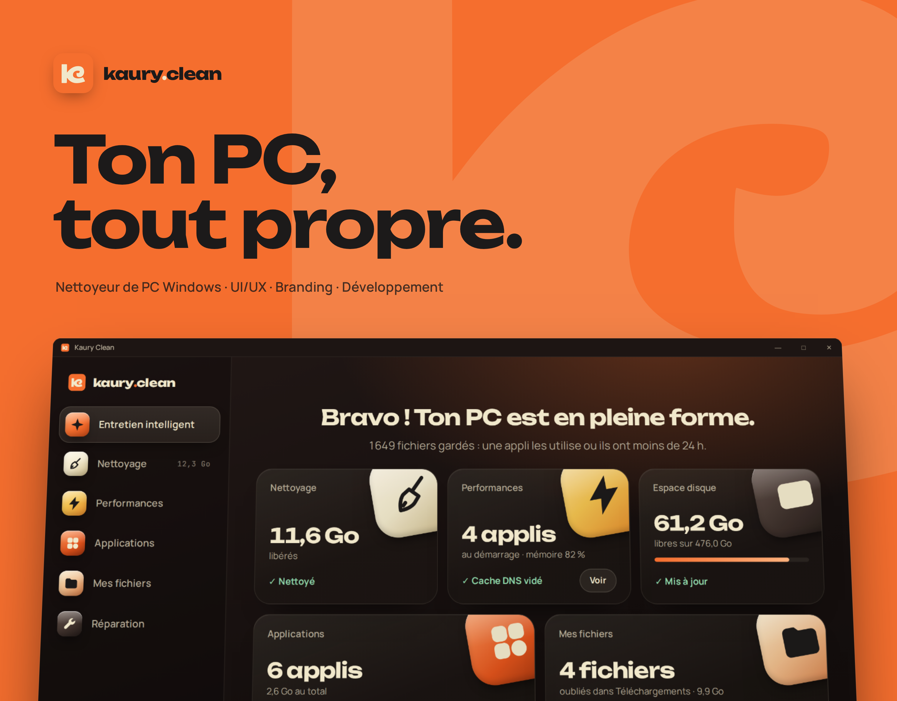
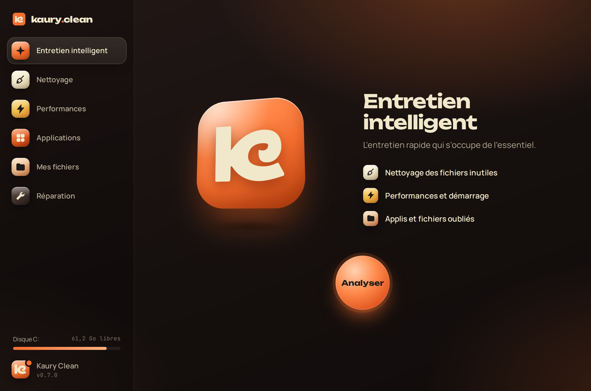
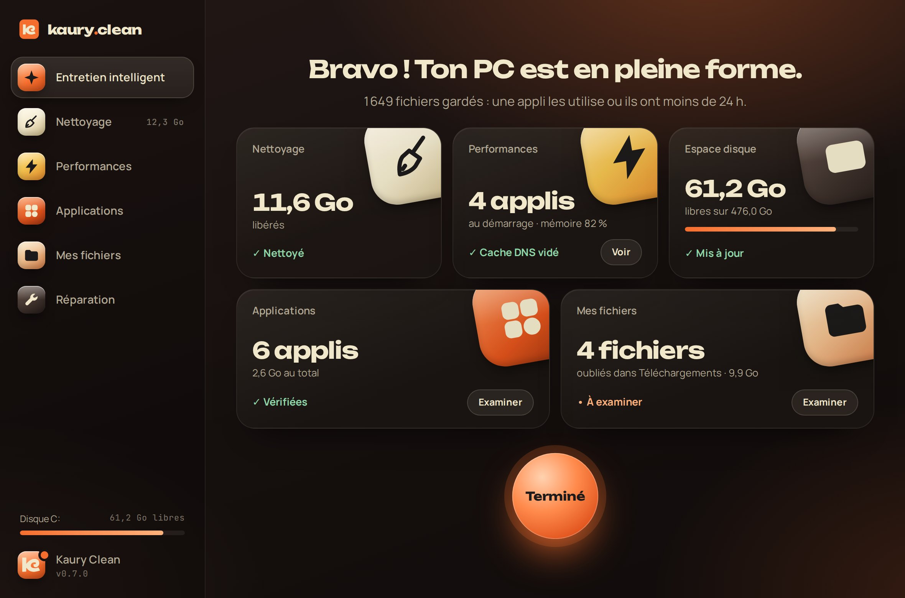
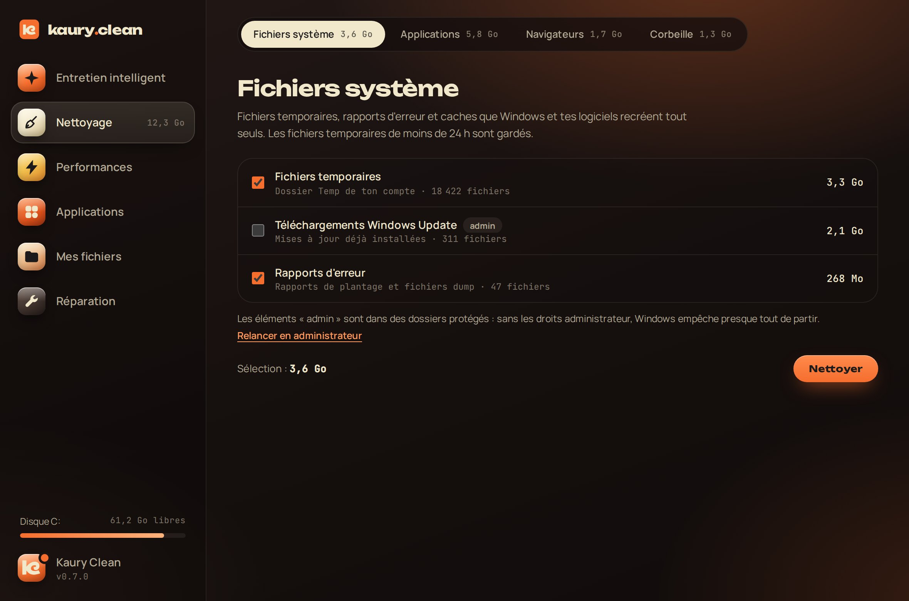
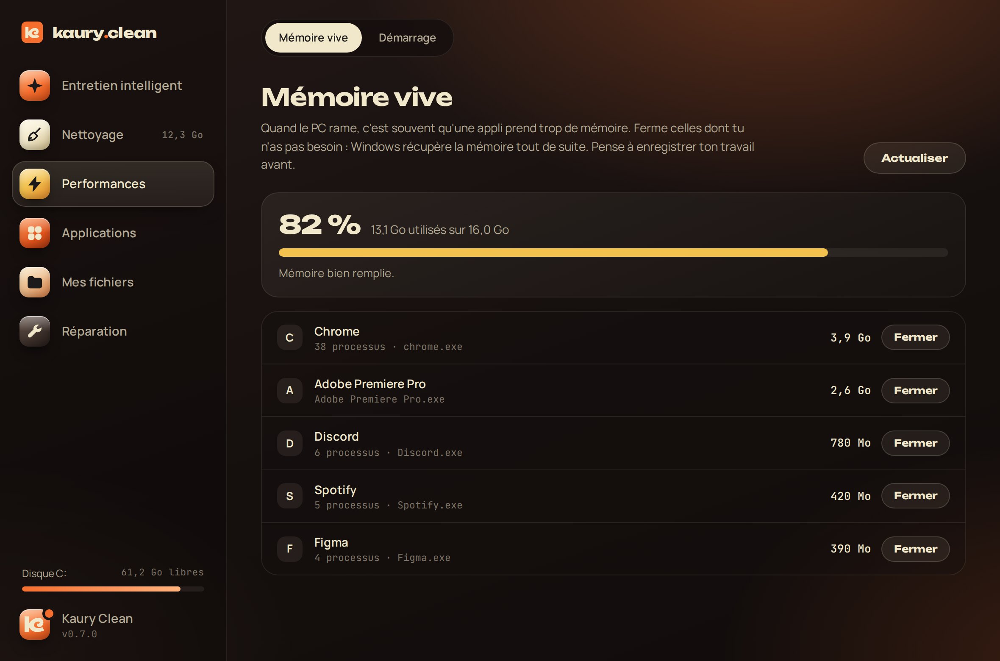
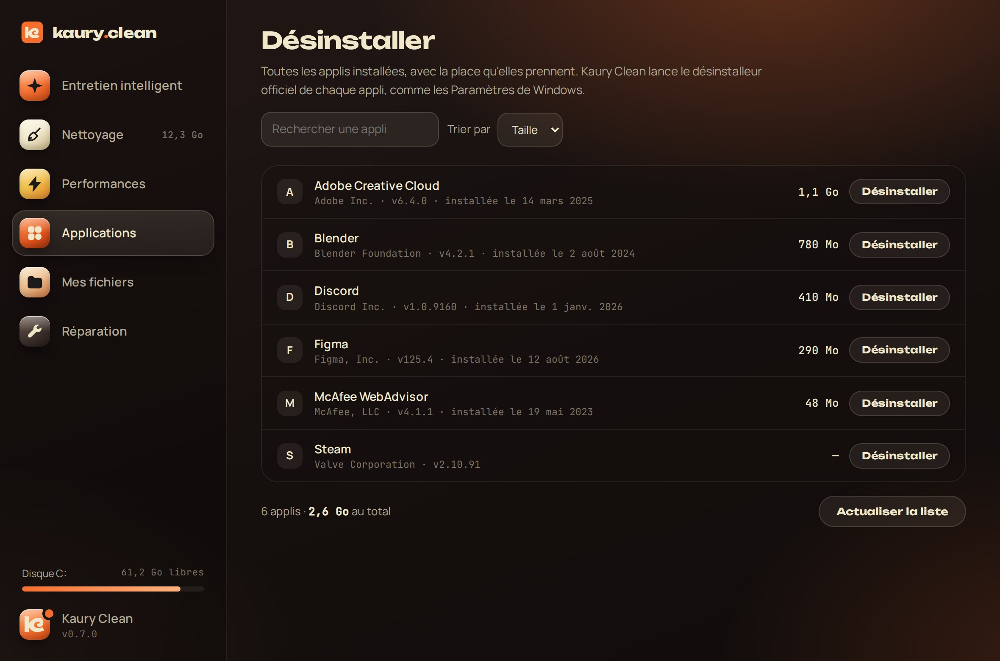
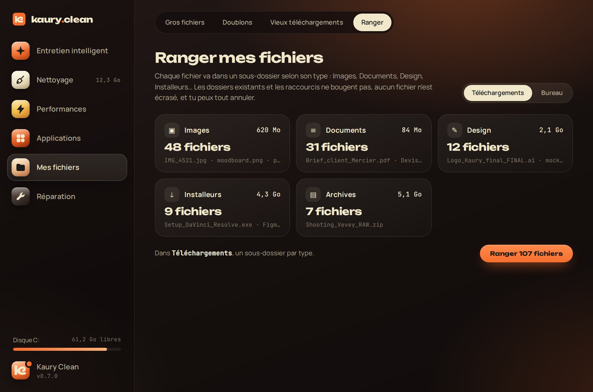
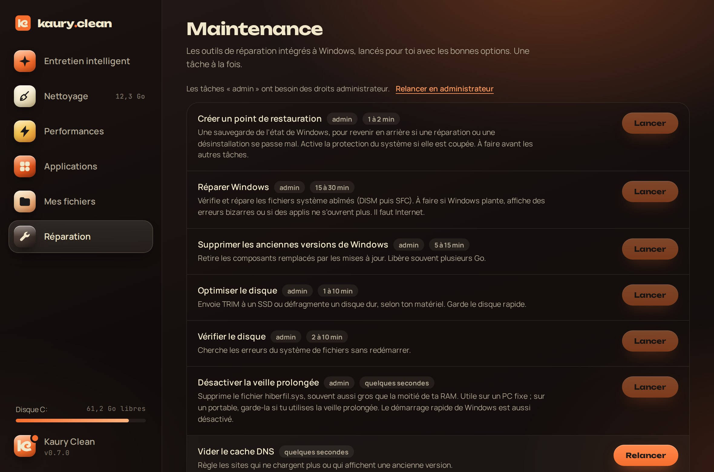
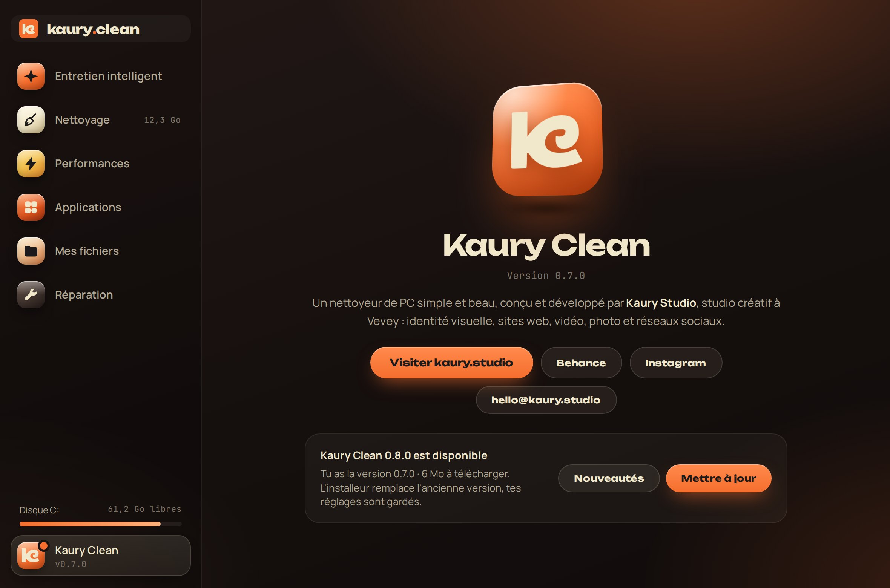

<p align="center">
  
</p>

<p align="center">
  <a href="https://github.com/theoblondel/kaury-clean/releases/latest"></a>
  <a href="https://github.com/theoblondel/kaury-clean/releases"></a>
  
  <a href="https://github.com/theoblondel/kaury-clean/actions/workflows/build.yml"></a>
</p>

<p align="center">
  <b>Un nettoyeur de PC Windows simple, beau et honnête.</b><br>
  L'esprit de CleanMyMac, la chaleur de <a href="https://kaury.studio">Kaury Studio</a>.
</p>

<p align="center">
  <a href="https://github.com/theoblondel/kaury-clean/releases/latest"></a>
</p>

<p align="center"><sub>🇬🇧 A simple, beautiful and honest Windows PC cleaner by Kaury Studio. Smart scan, cleanup, performance, uninstaller, file tidying and Windows repair tools, all in one app.</sub></p>

---

## Entretien intelligent

Un seul bouton. Kaury Clean passe en revue les fichiers inutiles, les applis au démarrage, la mémoire, le disque, les applis installées et les vieux téléchargements, puis présente un bilan en cartes. **Lancer** nettoie ce qui est sûr, section par section, et vide le cache DNS. Le reste t'attend dans chaque section.

<table>
  <tr>
    <td width="50%"></td>
    <td width="50%"></td>
  </tr>
  <tr>
    <td></td>
    <td></td>
  </tr>
</table>

## Six sections

| | Section | Ce qu'elle fait |
| --- | --- | --- |
| 🧹 | **Nettoyage** | Fichiers système (temporaires, Windows Update, rapports d'erreur, cache graphique), caches d'applis (Adobe, Spotify, Discord, Steam, npm), navigateurs (Chrome, Edge, Brave, Firefox) et corbeille. |
| ⚡ | **Performances** | **Mémoire vive** : les applis qui remplissent la RAM, fermées proprement ou de force. **Démarrage** : active ou désactive les applis lancées avec Windows. |
| 🧩 | **Applications** | Toutes les applis installées avec leur taille, recherche et tri. Lance le désinstalleur officiel. |
| 📁 | **Mes fichiers** | **Gros fichiers**, **doublons** (comparés par leur contenu), **vieux téléchargements**, et **rangement** de Téléchargements ou du Bureau par type, annulable. |
| 🔧 | **Réparation** | Point de restauration, réparation de Windows (DISM + SFC), anciennes versions de Windows, optimisation et vérification du disque, veille prolongée, cache DNS, Explorateur, icônes, Microsoft Store. |
| ✦ | **Kaury Clean** | La page du studio (site, Behance, Instagram, contact) et les mises à jour. |

<table>
  <tr>
    <td width="33%"></td>
    <td width="33%"></td>
    <td width="33%"></td>
  </tr>
  <tr>
    <td></td>
    <td></td>
    <td></td>
  </tr>
</table>

## Principes

- **Rien ne part sans toi.** Tu vois chaque élément avant de nettoyer. Gros fichiers et doublons passent par la corbeille.
- **Toujours réversible quand c'est possible.** Les applis au démarrage sont désactivées, pas supprimées. Le rangement s'annule d'un clic.
- **Pas de faux « nettoyage de RAM ».** Windows gère déjà la mémoire : vider la RAM ne fait que la remplir à nouveau en ralentissant le PC. Kaury Clean montre les applis gourmandes et te laisse les fermer.
- **Pas de nettoyage du registre.** Il n'accélère rien et peut casser Windows.
- **OneDrive respecté.** Les fichiers restés dans le cloud ne sont jamais lus, donc jamais téléchargés.
- **Les outils de Windows.** Les réparations passent par DISM, SFC, chkdsk et les points de restauration, pas par des recettes maison.

<details>
<summary><b>Sécurité, dans le détail</b></summary>

- Les dossiers nettoyés sont fixés dans le code Rust. L'interface n'envoie que des identifiants, jamais de chemins.
- Les fichiers temporaires de moins de 24 h sont gardés, et les fichiers utilisés par une appli ouverte sont ignorés.
- Les liens et jonctions ne sont jamais suivis : on ne sort jamais du dossier nettoyé.
- Gros fichiers et doublons : seulement dans tes dossiers perso, et impossible de supprimer toutes les copies d'un même fichier.
- Rangement : seuls les fichiers directement dans le dossier bougent, jamais les sous-dossiers ni les raccourcis, et aucun fichier n'est écrasé.
- Désinstaller et Réparation : seuls les désinstalleurs officiels et les outils de Windows sont lancés, avec des commandes fixées dans le code.
- Mémoire vive : les processus de Windows ne sont jamais proposés à la fermeture.
- Mises à jour : seuls les installeurs publiés dans les releases de ce repo sont acceptés, et l'adresse est vérifiée côté Rust.
- Droits administrateur : l'appli démarre sans. Les dossiers protégés de Windows sont signalés « admin » et décochés, avec un lien pour relancer en administrateur.

</details>

## Installer

1. Télécharge `Kaury.Clean_…_x64-setup.exe` depuis la **[dernière release](https://github.com/theoblondel/kaury-clean/releases/latest)**.
2. Ouvre-le. Si Windows affiche « Windows a protégé votre ordinateur », clique sur **Informations complémentaires** puis **Exécuter quand même** : l'appli n'est pas encore signée avec un certificat.
3. Kaury Clean s'installe dans Programmes, avec un raccourci dans le menu Démarrer (dossier Kaury Studio) et sur le Bureau. Il se désinstalle depuis **Paramètres > Applications**.

**Mises à jour :** à chaque ouverture, Kaury Clean vérifie s'il existe une nouvelle version et propose de l'installer en un clic. L'installeur téléchargé par l'appli remplace l'ancienne version et garde tes réglages.

## Développer

Il faut [Node.js](https://nodejs.org) et [Rust](https://rustup.rs).

```bash
npm install
npm run dev      # lance l'appli
npm run build    # crée l'installeur Windows
cargo test --manifest-path src-tauri/Cargo.toml
```

L'interface est en HTML, CSS et JavaScript, sans framework. Ouverte directement dans un navigateur (`src/index.html`), elle tourne en **mode démo** avec des données d'exemple, pratique pour travailler le design. Le moteur est en Rust avec [Tauri 2](https://tauri.app).

```
src/
  index.html, styles.css
  main.js             navigation, entretien intelligent, nettoyage, fichiers, démarrage
  modules.js          vieux téléchargements, rangement, mémoire, désinstaller, réparation, À propos, mises à jour
src-tauri/src/
  junk.rs             fichiers inutiles : analyse et nettoyage
  files.rs            gros fichiers, doublons, vieux téléchargements, corbeille
  organize.rs         rangement des dossiers par type
  memory.rs           mémoire vive et fermeture d'applis
  startup.rs          applis au démarrage
  uninstall.rs        applis installées
  maintenance.rs      outils de réparation de Windows
  update.rs           vérification et installation des mises à jour
  elevation.rs        droits administrateur, ouverture des liens
  fsutil.rs           mesure et vidage de dossiers
design/
  logo.svg, k.svg     icône de l'appli et monogramme Kaury
  screens/            captures de l'appli
  behance/            visuels de présentation (FR, et EN dans behance/en)
```

### Publier une nouvelle version

1. Change le numéro de version dans `package.json`, `src-tauri/Cargo.toml` et `src-tauri/tauri.conf.json`, puis pousse sur `main`.
2. Sur GitHub : **Releases** > **Draft a new release** > **Choose a tag**, tape `v0.8.0` et choisis **Create new tag**. Clique sur **Publish release**.
3. GitHub Actions compile l'installeur et l'ajoute à la release (environ 5 minutes). Les applis déjà installées proposent la mise à jour à leur prochaine ouverture.

Chaque push sur `main` compile aussi l'installeur (onglet **Actions**, artefact `kaury-clean-windows`), pratique pour tester avant de publier.

---

<p align="center">
  <br>
  Conçu et développé par <a href="https://kaury.studio"><b>Kaury Studio</b></a>, Vevey<br>
  <a href="https://www.behance.net/kaurystudio">Behance</a> · <a href="https://www.instagram.com/kaury.studio/">Instagram</a> · <a href="mailto:hello@kaury.studio">hello@kaury.studio</a>
</p>
