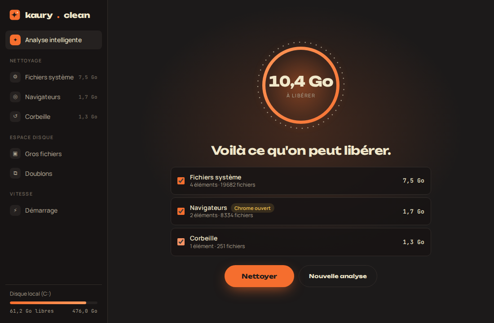

<p align="center"></p>

<h1 align="center">Kaury Clean</h1>

<p align="center">Un nettoyeur de PC Windows simple et beau, inspiré de CleanMyMac.<br>Par <a href="https://kaury.studio">Kaury Studio</a>.</p>

<p align="center"></p>

## Ce qu'il fait

**Nettoyage**

| Module | Ce qu'il fait |
| --- | --- |
| **Analyse intelligente** | Un clic pour voir tout ce qui peut partir, puis tu choisis. |
| **Fichiers système** | Fichiers temporaires, Windows Update, optimisation de la distribution, rapports d'erreur, cache de la carte graphique. |
| **Applications** | Caches de Spotify, Discord, Steam, npm et cache média Adobe (Premiere Pro, After Effects). |
| **Navigateurs** | Cache de Chrome, Edge, Brave et Firefox. Mots de passe, favoris, historique et sessions ne sont jamais touchés. |
| **Corbeille** | Vide la corbeille de tous les disques. |

**Espace disque**

| Module | Ce qu'il fait |
| --- | --- |
| **Gros fichiers** | Les fichiers les plus lourds de tes dossiers perso, avec un bouton pour les afficher dans l'Explorateur. |
| **Doublons** | Fichiers identiques (comparaison du contenu, pas du nom). La copie la plus récente est gardée. |
| **Vieux téléchargements** | Ce qui traîne dans Téléchargements depuis 3 mois, 6 mois ou 1 an. |
| **Ranger mes fichiers** | Range Téléchargements ou le Bureau en sous-dossiers par type (Images, Documents, Design, Installeurs…). Annulable. |

**Vitesse**

| Module | Ce qu'il fait |
| --- | --- |
| **Mémoire vive** | Montre quelles applis remplissent la RAM et les ferme proprement (ou de force si elles bloquent). |
| **Démarrage** | Active ou désactive les applis lancées avec Windows (registre et dossiers Démarrage), comme le Gestionnaire des tâches. |
| **Désinstaller** | Toutes les applis installées avec leur taille, recherche et tri. Lance le désinstalleur officiel. |

**Réparation**

| Tâche | Ce qu'elle fait |
| --- | --- |
| **Créer un point de restauration** | Sauvegarde l'état de Windows avant une réparation, pour pouvoir revenir en arrière. |
| **Réparer Windows** | DISM puis SFC : répare les fichiers système abîmés. |
| **Supprimer les anciennes versions de Windows** | Nettoyage des composants (DISM), libère souvent plusieurs Go. |
| **Optimiser le disque** | TRIM pour un SSD, défragmentation pour un disque dur. |
| **Vérifier le disque** | `chkdsk /scan`, sans redémarrer. |
| **Désactiver la veille prolongée** | Supprime `hiberfil.sys` (souvent plusieurs Go). Réactivable avec `powercfg /h on`. |
| **Vider le cache DNS**, **Redémarrer l'Explorateur**, **Rafraîchir les icônes**, **Réparer le Microsoft Store** | Les petites réparations du quotidien. |

L'accueil affiche l'état du PC (disque, mémoire, applis au démarrage). Les tâches longues affichent leur pourcentage, et les recherches peuvent être arrêtées. L'appli garde le compte de l'espace libéré depuis l'installation.

#### Et la RAM ?

Kaury Clean n'a pas de bouton « nettoyer la RAM ». Windows gère déjà la mémoire tout seul, et vider la RAM ne fait que la remplir à nouveau quelques secondes plus tard, en ralentissant le PC. Ce qui marche vraiment, c'est de fermer les applis qui en prennent trop : c'est ce que fait le module Mémoire vive.

### Droits administrateur

Kaury Clean démarre sans droits particuliers. Les dossiers protégés de Windows (`C:\Windows\Temp`, Windows Update) sont alors signalés « admin » et décochés. Le lien **Relancer en administrateur** rouvre l'appli avec les droits, après la confirmation de Windows.

## Sécurité

- Les dossiers nettoyés sont fixés dans le code Rust. L'interface envoie seulement des identifiants, jamais de chemins.
- Les fichiers temporaires de moins de 24 h sont gardés, et les fichiers utilisés par une appli ouverte sont ignorés.
- Les liens et jonctions ne sont jamais suivis : on ne sort jamais du dossier nettoyé.
- Gros fichiers et doublons partent **à la corbeille**, jamais supprimés directement, et seulement depuis tes dossiers perso.
- Doublons : impossible de supprimer toutes les copies d'un même fichier.
- OneDrive : les fichiers restés dans le cloud sont ignorés. Ils ne prennent pas de place, et les lire les téléchargerait.
- Démarrage : rien n'est supprimé, l'appli est juste marquée « désactivée ». Un clic pour la réactiver.
- Rangement : seuls les fichiers directement dans le dossier bougent, jamais les sous-dossiers ni les raccourcis. Aucun fichier n'est écrasé et le dernier rangement s'annule d'un clic.
- Désinstaller et Maintenance : seuls les désinstalleurs officiels et les outils de Windows sont lancés, avec des commandes fixées dans le code.
- Mémoire vive : les processus de Windows ne sont jamais proposés à la fermeture.
- Pas de « nettoyage du registre » : ça ne rend pas le PC plus rapide et ça peut casser Windows.

## Télécharger

Va dans **[Releases](../../releases/latest)** et télécharge `Kaury Clean_…_x64-setup.exe`.

L'installeur installe Kaury Clean dans Programmes pour tous les comptes du PC, avec un raccourci dans le menu Démarrer (dossier Kaury Studio) et sur le Bureau. L'appli apparaît dans **Paramètres > Applications**, d'où elle se désinstalle comme n'importe quel logiciel.

Au premier lancement, Windows SmartScreen peut afficher « Windows a protégé votre ordinateur » : l'appli n'est pas encore signée avec un certificat. Clique sur **Informations complémentaires** puis **Exécuter quand même**.

### Publier une nouvelle version

1. Change le numéro de version dans `package.json`, `src-tauri/Cargo.toml` et `src-tauri/tauri.conf.json`, puis pousse sur `main`.
2. Sur GitHub, onglet **Releases** > **Draft a new release** > **Choose a tag** : tape `v0.6.0` et choisis **Create new tag**. Clique sur **Publish release**.
3. GitHub Actions compile l'installeur et l'ajoute à la release, avec les instructions d'installation (environ 5 minutes).

Chaque push sur `main` compile aussi l'installeur (onglet **Actions**, artefact `kaury-clean-windows`), pratique pour tester avant de publier.

## Développer

Il faut [Node.js](https://nodejs.org) et [Rust](https://rustup.rs).

```bash
npm install
npm run dev      # lance l'appli
npm run build    # crée l'installeur Windows
cargo test --manifest-path src-tauri/Cargo.toml
```

L'interface (`src/main.js`, `src/modules.js`) est en HTML, CSS et JavaScript sans framework. Ouverte directement dans un navigateur, elle tourne en **mode démo** avec des données d'exemple, pratique pour travailler le design.
Le moteur (`src-tauri/src/`) est en Rust avec [Tauri 2](https://tauri.app).

```
src/                interface
src-tauri/src/
  junk.rs           fichiers inutiles : analyse et nettoyage
  files.rs          gros fichiers, doublons, vieux téléchargements, corbeille
  organize.rs       rangement des dossiers par type
  memory.rs         mémoire vive et fermeture d'applis
  startup.rs        applis au démarrage
  uninstall.rs      applis installées
  maintenance.rs    outils de réparation de Windows
  elevation.rs      droits administrateur
  fsutil.rs         mesure et vidage de dossiers
design/             logo et captures
```
