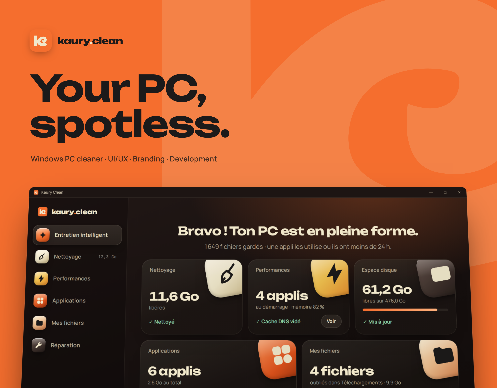
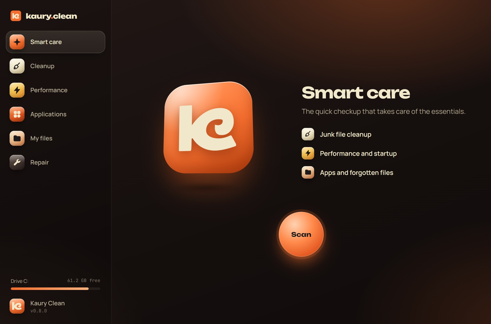
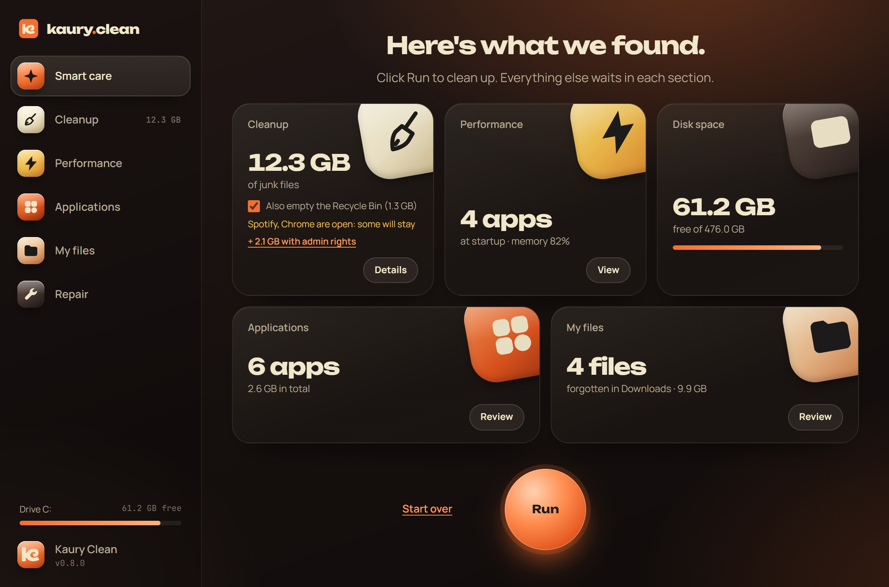
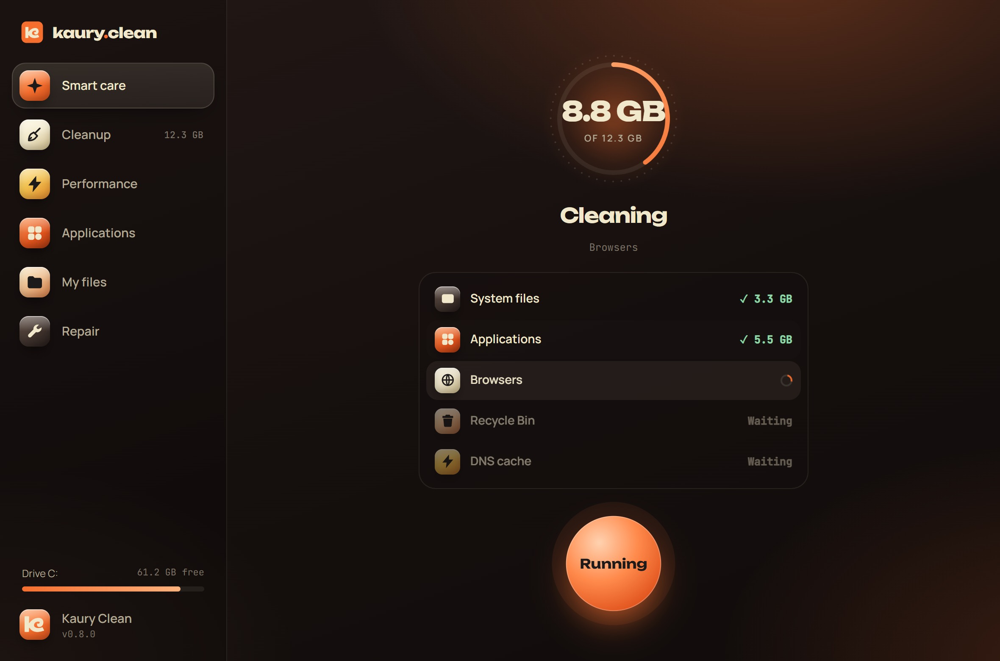
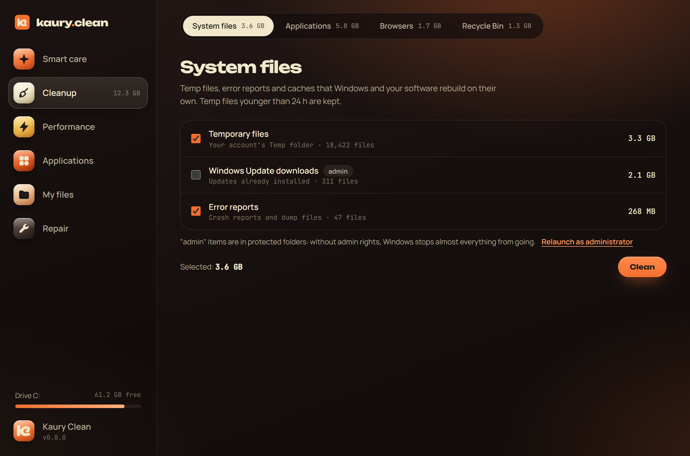
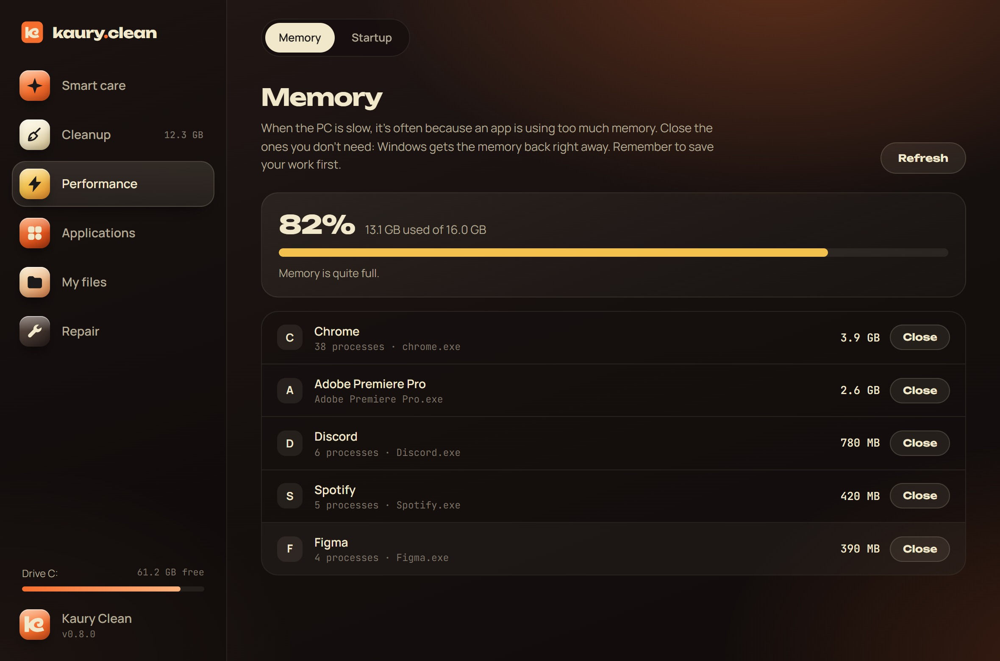
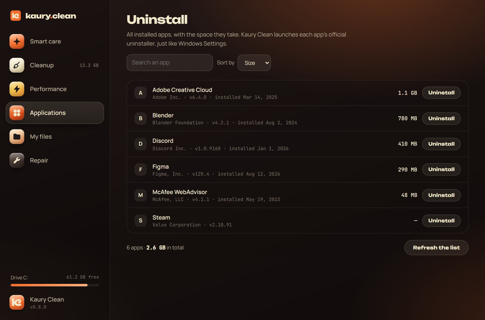
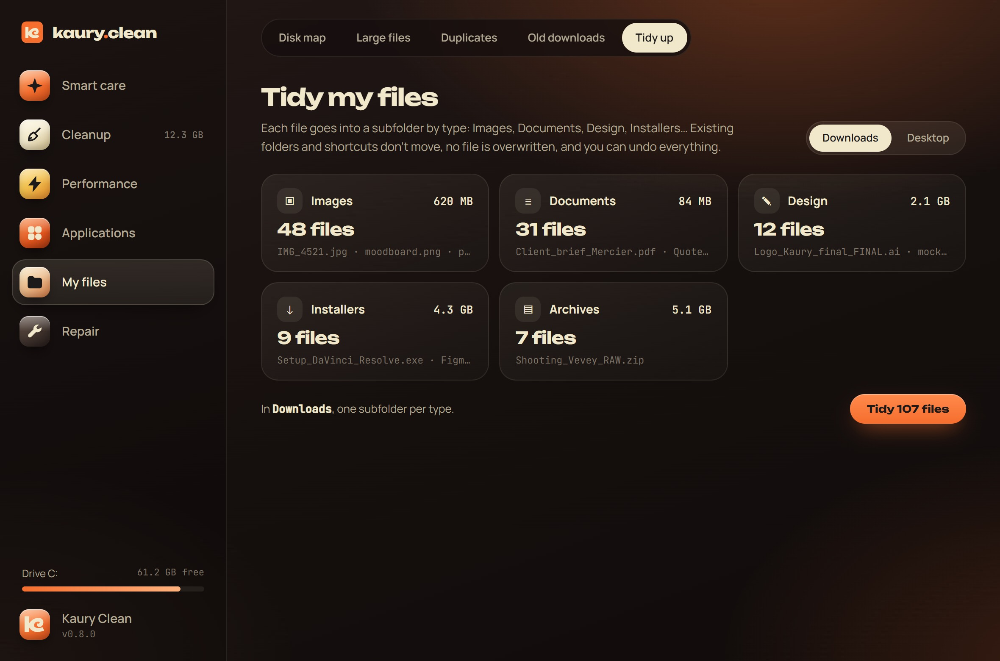
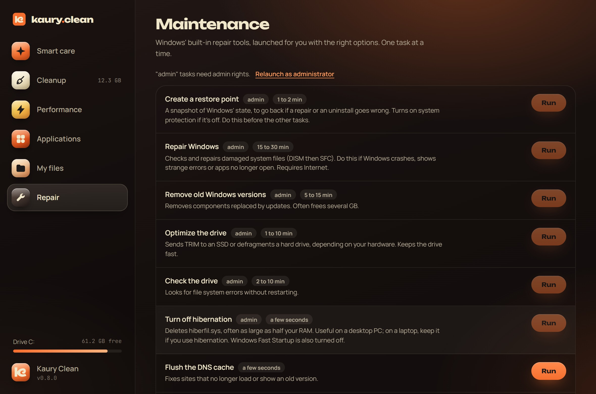
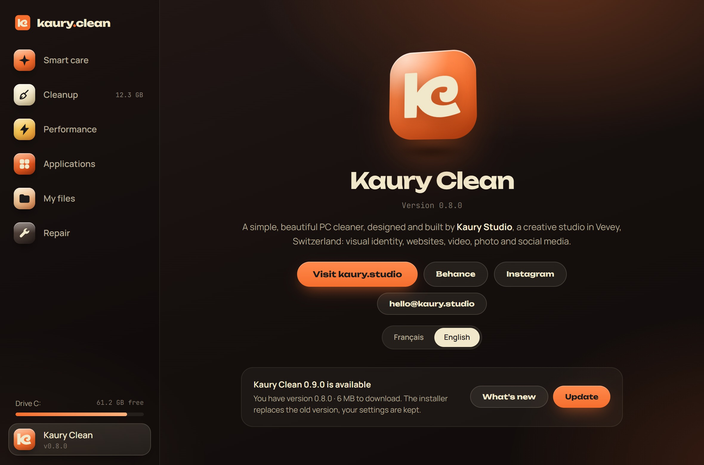

<p align="center">
  
</p>

<p align="center">
  <a href="https://github.com/theoblondel/kaury-clean/releases/latest"></a>
  <a href="https://github.com/theoblondel/kaury-clean/releases"></a>
  
  <a href="https://github.com/theoblondel/kaury-clean/actions/workflows/build.yml"></a>
</p>

<p align="center">
  <b>A simple, beautiful and honest Windows PC cleaner.</b><br>
  It only touches what piles up for nothing, and shows you everything first.<br>
  Built in Rust with Tauri: a 1.6 MB installer, no ads, no account, no telemetry.
</p>

<p align="center">
  <a href="https://github.com/theoblondel/kaury-clean/releases/latest"></a>
</p>

<p align="center"><b>English</b> · <a href="README.fr.md">Français</a></p>

<p align="center"><sub>Like Kaury Clean? A ⭐ at the top right helps other people find it.</sub></p>

> The app speaks English and French: it follows your Windows language, and you can switch in **About**.

---

## Smart care

One button. Kaury Clean reviews junk files, startup apps, memory, disk, installed apps and old downloads, then shows a summary as cards. **Run** cleans what is safe, section by section, and flushes the DNS cache. Everything else waits for you in its own section.

<table>
  <tr>
    <td width="50%"></td>
    <td width="50%"></td>
  </tr>
  <tr>
    <td></td>
    <td></td>
  </tr>
</table>

## Six sections

| | Section | What it does |
| --- | --- | --- |
| 🧹 | **Cleanup** | System files (temp files, Windows Update, error reports, graphics cache), app caches (Adobe, Spotify, Discord, Slack, Teams, WhatsApp, Steam, Epic Games, VS Code, Cursor, npm, Yarn, pip, uv), browsers (Chrome, Edge, Brave, Firefox, Opera, Vivaldi) and the Recycle Bin. |
| ⚡ | **Performance** | **Memory**: the apps filling your RAM, closed gracefully or forced. **Startup**: turn apps launched with Windows on or off. |
| 🧩 | **Applications** | Every installed app with its size, search and sort. Runs the official uninstaller. |
| 📁 | **My files** | **Disk map** (what takes up space, read-only), **large files**, **duplicates** (compared by content), **old downloads**, and **tidying** of Downloads or the Desktop by type, with undo. |
| 🔧 | **Repair** | Restore point, Windows repair (DISM + SFC), previous Windows installations, disk optimization and check, hibernation, DNS cache, Explorer, icons, Microsoft Store. |
| ✦ | **Kaury Clean** | The studio page (website, Behance, Instagram, contact) and updates. |

<table>
  <tr>
    <td width="33%"></td>
    <td width="33%"></td>
    <td width="33%"></td>
  </tr>
  <tr>
    <td></td>
    <td></td>
    <td></td>
  </tr>
</table>

## Principles

- **Nothing goes without you.** You see every item before cleaning. Large files and duplicates go to the Recycle Bin.
- **Reversible whenever possible.** Startup apps are disabled, not deleted. Tidying can be undone in one click.
- **No fake "RAM cleaning".** Windows already manages memory: emptying RAM only fills it again while slowing the PC down. Kaury Clean shows the hungry apps and lets you close them.
- **No registry cleaning.** It speeds nothing up and can break Windows.
- **OneDrive respected.** Files left in the cloud are never read, so never downloaded.
- **Windows' own tools.** Repairs go through DISM, SFC, chkdsk and restore points, not home-made recipes.

<details>
<summary><b>Security, in detail</b></summary>

- Cleaned folders are hard-coded in Rust. The interface only sends identifiers, never paths.
- Temp files younger than 24 hours are kept, and files in use by an open app are skipped.
- Links and junctions are never followed: cleaning never leaves the target folder. Each file is deleted through its real location, checked at the very moment of deletion: a folder secretly swapped for a junction to Windows leads nowhere.
- Large files and duplicates: only in your personal folders, and you can never delete every copy of the same file.
- Tidying: only files directly inside the folder move, never subfolders or shortcuts, and no file is ever overwritten.
- Repair: only official uninstallers and Windows tools are launched, with commands fixed in the code.
- Memory: Windows processes are never offered for closing.
- Updates: every installer is signed with a key that never leaves Kaury Studio's PC. Without a valid signature nothing runs, even if published on this repo. The verified installer stays locked until it is launched.
- Admin rights: the app starts without them. Protected Windows folders are flagged "admin" and unchecked, with a link to relaunch as administrator.
- As administrator, the app cannot be used as a relay by another program: your account's folders are only touched if they really are in your profile (a TEMP variable or a Documents folder redirected to Windows is ignored), Windows tools are launched by their full path, apps installed for your account only are not uninstalled with those rights, and undoing a tidy-up refuses any move it did not make itself. Your personal files (Recycle Bin, tidying) never move with those rights, and `WEBVIEW2_*` variables, which could swap the rendering engine, are ignored.

</details>

## Install

1. Download `Kaury.Clean_…_x64-setup.exe` from the **[latest release](https://github.com/theoblondel/kaury-clean/releases/latest)**.
2. Open it. If Windows shows "Windows protected your PC", click **More info** then **Run anyway**: the app is not signed with a code-signing certificate yet.
3. Kaury Clean installs in Program Files, with a shortcut in the Start menu (Kaury Studio folder) and on the Desktop. Uninstall it from **Settings > Apps**.

**Updates:** each time it opens, Kaury Clean checks for a new version and offers to install it in one click. The installer replaces the previous version and keeps your settings.

## Develop

You need [Node.js](https://nodejs.org) and [Rust](https://rustup.rs).

```bash
npm install
npm run dev      # run the app
npm run build    # build the Windows installer
cargo test --manifest-path src-tauri/Cargo.toml
```

The interface is plain HTML, CSS and JavaScript, no framework. Opened directly in a browser (`src/index.html`), it runs in **demo mode** with sample data, handy for design work. The engine is Rust with [Tauri 2](https://tauri.app).

```
src/
  index.html, styles.css
  main.js             navigation, smart care, cleanup, files, startup
  modules.js          old downloads, tidying, memory, uninstall, repair, about, updates
src-tauri/src/
  junk.rs             junk files: scan and cleanup
  garde.rs            safety checks: real paths, admin rules, full tool paths
  langue.rs           French or English, chosen by the interface
  files.rs            large files, duplicates, old downloads, Recycle Bin
  space.rs            disk map (read-only)
  organize.rs         tidying folders by type
  memory.rs           memory and closing apps
  startup.rs          startup apps
  uninstall.rs        installed apps
  maintenance.rs      Windows repair tools
  update.rs           checking and installing signed updates
  elevation.rs        admin rights, opening links
  fsutil.rs           measuring and emptying folders
design/
  logo.svg, k.svg     app icon and Kaury monogram
  screens/            app screenshots
  behance/            presentation visuals (FR, and EN in behance/en)
```

Release steps are described in the [French README](README.fr.md#publier-une-nouvelle-version).

---

<p align="center">
  <br>
  Designed and built by <a href="https://kaury.studio"><b>Kaury Studio</b></a>, Vevey, Switzerland<br>
  <a href="https://www.behance.net/kaurystudio">Behance</a> · <a href="https://www.instagram.com/kaury.studio/">Instagram</a> · <a href="mailto:hello@kaury.studio">hello@kaury.studio</a>
</p>
